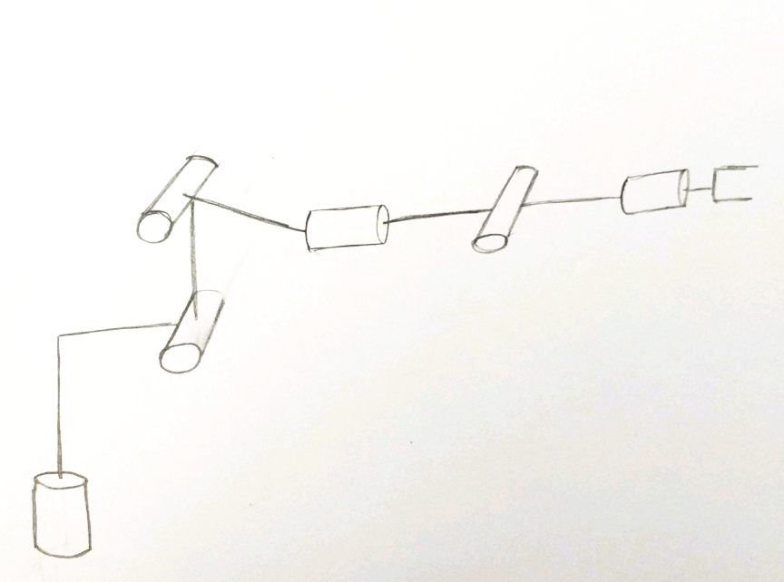
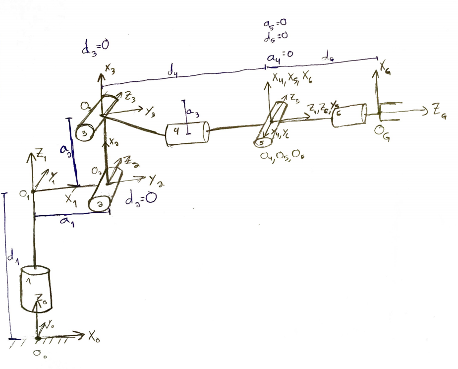
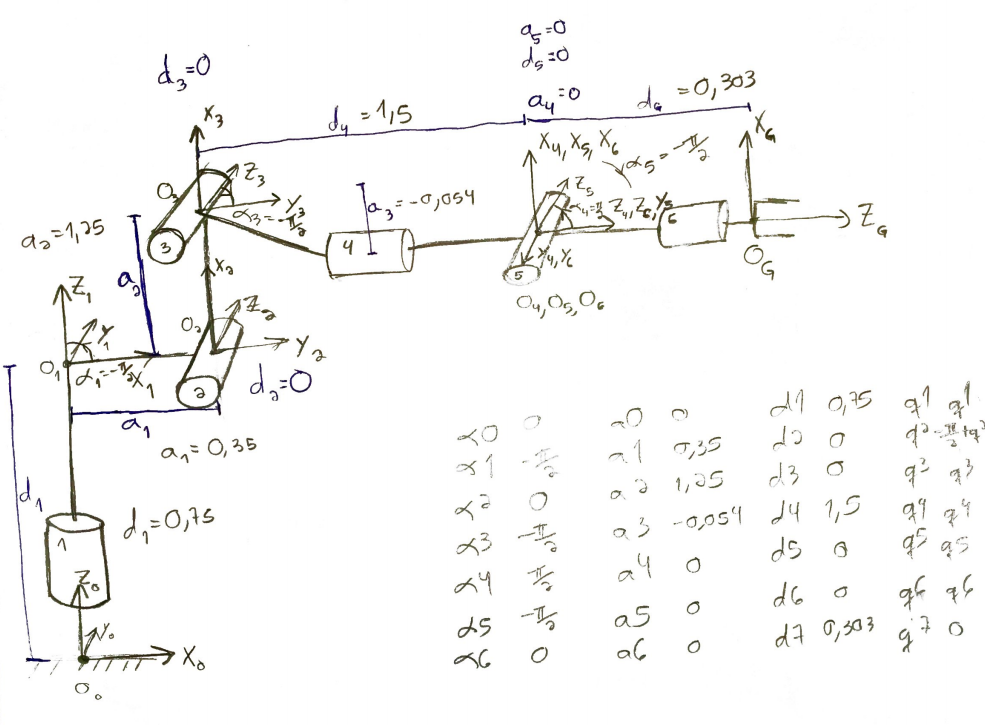

## Project: Kinematics Pick & Place

---

## [Rubric](https://review.udacity.com/#!/rubrics/972/view) Points

### Kinematic Analysis

First, the [IK_debug.py](IK_debug.py) script was completed with forward and inverse kinematics code. Symbolic variables were created and the table of Denavit–Hartenberg parameters was built.

Modified DH parameters were used, following the Craig, JJ. convention. The KUKA KR210 arm has 6 prismatic joints, meaning that the q parameters will be variable (the rotation around the Z axis).

Assignment of DH parameters was done in the following zero configuration:



DH frames were assigned:



The DH parameters were extracted by observing the kr210.urdf.xacro description of the joints. The following section has offsets between joints and allows us to extract link information:

```xml
<!-- joints -->
<joint name="fixed_base_joint" type="fixed">
  <parent link="base_footprint"/>
  <child link="base_link"/>
  <origin xyz="0 0 0" rpy="0 0 0"/>
</joint>
<joint name="joint_1" type="revolute">
  <origin xyz="0 0 0.33" rpy="0 0 0"/>
  <parent link="base_link"/>
  <child link="link_1"/>
  <axis xyz="0 0 1"/>
  <limit lower="${-185*deg}" upper="${185*deg}" effort="300" velocity="${123*deg}"/>
</joint>
<joint name="joint_2" type="revolute">
  <origin xyz="0.35 0 0.42" rpy="0 0 0"/>
  <parent link="link_1"/>
  <child link="link_2"/>
  <axis xyz="0 1 0"/>
  <limit lower="${-45*deg}" upper="${85*deg}" effort="300" velocity="${115*deg}"/>
</joint>
<joint name="joint_3" type="revolute">
  <origin xyz="0 0 1.25" rpy="0 0 0"/>
  <parent link="link_2"/>
  <child link="link_3"/>
  <axis xyz="0 1 0"/>
  <limit lower="${-210*deg}" upper="${(155-90)*deg}" effort="300" velocity="${112*deg}"/>
</joint>
<joint name="joint_4" type="revolute">
  <origin xyz="0.96 0 -0.054" rpy="0 0 0"/>
  <parent link="link_3"/>
  <child link="link_4"/>
  <axis xyz="1 0 0"/>
  <limit lower="${-350*deg}" upper="${350*deg}" effort="300" velocity="${179*deg}"/>
</joint>
<joint name="joint_5" type="revolute">
  <origin xyz="0.54 0 0" rpy="0 0 0"/>
  <parent link="link_4"/>
  <child link="link_5"/>
  <axis xyz="0 1 0"/>
  <limit lower="${-125*deg}" upper="${125*deg}" effort="300" velocity="${172*deg}"/>
</joint>
<joint name="joint_6" type="revolute">
  <origin xyz="0.193 0 0" rpy="0 0 0"/>
  <parent link="link_5"/>
  <child link="link_6"/>
  <axis xyz="1 0 0"/>
  <limit lower="${-350*deg}" upper="${350*deg}" effort="300" velocity="${219*deg}"/>
</joint>
```

The walkthrough provided by Udacity aided me in the most challenging parameters. Parameters q*i* are the angles between X*i-i* and X*i* along Z*i*, which are variable in revolute joints. q2 has a constant offset since X1 and X2 are not aligned in the zero configuration.

alpha*i-1* measures the angle between Z*i-1* and Z*i* along X*i-1* and is non-zero in alpha*1* (angle between Z1 and Z2), alpha*3*, alpha*4* and alpha*5* (the coordinate systems specified for joints 3, 4, 5 and 6 alternate rotating -pi/2 and pi/2 around the positive X axis).

I drew the parameters on my zero configuration and build a table:



The DH table was coded:

```python
alpha0, alpha1, alpha2, alpha3, alpha4, alpha5, alpha6 = symbols('alpha0:7')
a0, a1, a2, a3, a4, a5, a6 = symbols('d0:7')
d1, d2, d3, d4, d5, d6, d7 = symbols('d1:8')
q1, q2, q3, q4, q5, q6, q7 = symbols('q1:8')

dh_parameters = {
    alpha0: 0,          a0: 0,      d1: 0.75,   q1: q1,
    alpha1: -pi / 2,    a1: 0.35,   d2: 0,      q2: -pi/2 + q2,
    alpha2: 0,          a2: 1.25,   d3: 0,      q3: q3,
    alpha3: -pi / 2,    a3: -0.054, d4: 1.5,    q4: q4,
    alpha4: pi / 2,     a4: 0,      d5: 0,      q5: q5,
    alpha5: -pi / 2,    a5: 0,      d6: 0,      q6: q6,
    alpha6: 0,          a6: 0,      d7: 0.303,  q7: 0,
}
```

---

#### Transformation matrices about joints

The following formula is used to build a homogeneous transformation matrix from DH parameters. It is derived by composing the two rotations and two translations of the DH parameters:

```python
def dh_to_homogeneous_transform(alpha, a, d, q):
    return Matrix([
        [cos(q), -sin(q), 0, a],
        [sin(q) * cos(alpha), cos(q) * cos(alpha), -sin(alpha), -sin(alpha) * d],
        [sin(q) * sin(alpha), cos(q) * sin(alpha), cos(alpha), cos(alpha) * d],
        [0, 0, 0, 1],
    ])
```

The transformation matrices about each joint were built:

```python
T0_1 = dh_to_homogeneous_transform(alpha0, a0, d1, q1).subs(dh_parameters)
T1_2 = dh_to_homogeneous_transform(alpha1, a1, d2, q2).subs(dh_parameters)
T2_3 = dh_to_homogeneous_transform(alpha2, a2, d3, q3).subs(dh_parameters)
T3_4 = dh_to_homogeneous_transform(alpha3, a3, d4, q4).subs(dh_parameters)
T4_5 = dh_to_homogeneous_transform(alpha4, a4, d5, q5).subs(dh_parameters)
T5_6 = dh_to_homogeneous_transform(alpha5, a5, d6, q6).subs(dh_parameters)
T6_EE = dh_to_homogeneous_transform(alpha6, a6, d7, q7).subs(dh_parameters)
```

In addition, rotation from the base link to the wrist center and transformation from the base link to the end effector were built. These will be used at every IK calculation, so I decided to build them now and keep them cached. I also called [lambdify](http://docs.sympy.org/latest/modules/utilities/lambdify.html) on them to generate a numerical representation of the sympy function, so future calls to these transformations will incur a much lower overhead.

```python
T0_3 = T0_1 * T1_2 * T2_3
self.R0_3 = lambdify((q1, q2, q3), T0_3[0:3, 0:3])
self.T0_EE = lambdify((q1, q2, q3, q4, q5, q6), (T0_3 * T3_4 * T4_5 * T5_6 * T6_EE))
```

#### Decoupling Inverse Kinematics into Inverse Position Kinematics and Inverse Orientation Kinematics problems

Using the spherical wrist, the IK problem can be decoupled into Inverse Position Kinematics and Inverse Orientation Kinematics problems. First, the position of the wrist center will be determined. For a given wrist center position, we must ajust 3 DOF (joints 1, 2 and 3) to achieve it.

Adjusting joint 1 is trivial. It rotates around the Z axis of the base frame. Since joints 1, 2 and 3 are always contained in the same plane, joint 1 is the sole responsible for pointing the wrist center in the correct rotation around the Z axis of the base link. Thus, `theta1` can be derived from the X and Y positions of the wrist center:

```python
theta1 = atan2(WC[1], WC[0])
```

The link lengths and the positions of joints 2 and 4 are known, so the joint angles `theta2` and `theta3` can be derived using the cosine method. The three sides of the triangle for the cosine method are the link lengths and the distance between joints 2 and 4.

The distance between joints 2 and 4 can be calculated by the distance projected on the XY plane (distance from the base link to the wrist center minus the distance from the base link to joint 2 (`a1 = 0.35`))) and the distance on the Z axis (distance from the base link to the wrist center minus the Z distance from the base link to joint 2 (`d1 = 0.75`)): `dist(dist(WC[0], WC[1]) - 0.35, WC[2] - 0.75)`

Given the target positions of joints 2 and 4, most times there are two possible configurations of joint 3 that can achieve the target positions. In this exercice I always choose the configuration with joint 3 "above" joint 2 (most closely to the zero configuration), since there are physical limits to the movement below the robot (joint 3 could hit the ground):

```python
xy_joint_2_WC_distance = dist(WC[0], WC[1]) - 0.35
link_length = [1.501, dist(xy_joint_2_WC_distance, WC[2] - 0.75), 1.25]
angles = self.cosine_method_angles(link_length)
```

After the positions of joints 1, 2 and 3 have been solved, the tranformation from joint 3 to 6 can be calculated using the inverse of R1_3 and the end effector position. The inverse of R1_3 is the same of the transpose, since the rotation matrix is orthonormal. As shown in the class:


Thus:

```python
R3_6 = R0_3.transpose() * R_EE
```

Then, joint angles 4 through 6 have to be derived. I printed the symbolic version of R3_6 calculated by sympy:

```python
[
[-sin(q4) * sin(q6) + cos(q4) * cos(q5) * cos(q6),    -sin(q4) * sin(q6) + cos(q4) * cos(q5) * sin(q6),    -cos(q4) * sin(q5)],
[sin(q5) * cos(q6),                                   -sin(q5) * sin(q6),                                  cos(q5)],
[-cos(q4) * sin(q6) - sin(q4) * cos(q5) * cos(q6),    -cos(q4) * cos(q6) + sin(q4) * cos(q5) * sin(q6),    sin(q4) * sin(q5)]
]
```

`q4` can be derived from `atan2(R3_6[2, 2], -R3_6[0, 2])` (`atan2(sin(q4) * sin(q5), -(-cos(q4) * sin(q5)))`, since the `sin(q5)` multiplier on both parameters of `atan2` won't change the angle). `q5` can be derived from `atan2(dist(R3_6[0, 2], R3_6[2, 2]), R3_6[1, 2])` (`atan2(dist(-cos(q4) * sin(q5), sin(q4) * sin(q5)), cos(q5))` = `atan2(sqrt(sin(q5) ** 2 * (sin(q4) ** 2 + cos(q4) ** 2)), cos(q5))` = `atan2(sin(q5), cos(q5))`). `q6` can be derived from `atan2(-R3_6[1, 1], R3_6[1, 0])` (`atan2(-(-sin(q5) * sin(q6)), sin(q5) * cos(q6))`).

### Project Implementation

The [IK_debug.py](IK_debug.py) script was used for debugging and error calculation.

Then, I moved to [IK_server.py](kuka_arm/scripts/IK_server.py) and added optimizations. First, a few functions were created to avoid repeatedly typing them:

```python
def sq(n):
    return n * n


def dist(*coords):
    return sqrt(sum(sq(x) for x in coords))


def angle_between(a, b):
    angle = (a - b) % (2 * pi)
    if angle > pi:
        angle -= 2 * pi
    return angle
```

A class was used to persist IK and FK information and avoid recalculation on each frame. Most transformations were cached during initialization for future use. Once a transformation was calculated, I translated it into a function with the `lambdify` function from sympy to optimize it and avoid symbolic operations:

```python
class IK:
    def __init__(self):
        self._initialize_direct_kinematics()
        self._initialize_inverse_kinematics()

    def _initialize_inverse_kinematics(self):
        r, p, y = symbols('r p y')

        # Rotation matrices
        R_x = Matrix([
            [1, 0, 0],
            [0, cos(r), -sin(r)],
            [0, sin(r), cos(r)],
        ])
        R_y = Matrix([
            [cos(p), 0, sin(p)],
            [0, 1, 0],
            [-sin(p), 0, cos(p)],
        ])
        R_z = Matrix([
            [cos(y), -sin(y), 0],
            [sin(y), cos(y), 0],
            [0, 0, 1],
        ])
        R_correction = R_z.subs(y, radians(180)) * R_y.subs(p, radians(-90))
        self.R_EE = lambdify((r, p, y), R_z * R_y * R_x * R_correction)

    def _initialize_direct_kinematics(self):
        alpha0, alpha1, alpha2, alpha3, alpha4, alpha5, alpha6 = symbols('alpha0:7')
        a0, a1, a2, a3, a4, a5, a6 = symbols('d0:7')
        d1, d2, d3, d4, d5, d6, d7 = symbols('d1:8')
        q1, q2, q3, q4, q5, q6, q7 = symbols('q1:8')

        dh_parameters = {
            alpha0: 0,          a0: 0,      d1: 0.75,   q1: q1,
            alpha1: -pi / 2,    a1: 0.35,   d2: 0,      q2: -pi/2 + q2,
            alpha2: 0,          a2: 1.25,   d3: 0,      q3: q3,
            alpha3: -pi / 2,    a3: -0.054, d4: 1.5,    q4: q4,
            alpha4: pi / 2,     a4: 0,      d5: 0,      q5: q5,
            alpha5: -pi / 2,    a5: 0,      d6: 0,      q6: q6,
            alpha6: 0,          a6: 0,      d7: 0.303,  q7: 0,
        }

        def dh_to_homogeneous_transform(alpha, a, d, q):
            return Matrix([
                [cos(q), -sin(q), 0, a],
                [sin(q) * cos(alpha), cos(q) * cos(alpha), -sin(alpha), -sin(alpha) * d],
                [sin(q) * sin(alpha), cos(q) * sin(alpha), cos(alpha), cos(alpha) * d],
                [0, 0, 0, 1],
            ])

        T0_1 = dh_to_homogeneous_transform(alpha0, a0, d1, q1).subs(dh_parameters)
        T1_2 = dh_to_homogeneous_transform(alpha1, a1, d2, q2).subs(dh_parameters)
        T2_3 = dh_to_homogeneous_transform(alpha2, a2, d3, q3).subs(dh_parameters)
        T3_4 = dh_to_homogeneous_transform(alpha3, a3, d4, q4).subs(dh_parameters)
        T4_5 = dh_to_homogeneous_transform(alpha4, a4, d5, q5).subs(dh_parameters)
        T5_6 = dh_to_homogeneous_transform(alpha5, a5, d6, q6).subs(dh_parameters)
        T6_EE = dh_to_homogeneous_transform(alpha6, a6, d7, q7).subs(dh_parameters)

        T0_3 = T0_1 * T1_2 * T2_3
        self.R0_3 = lambdify((q1, q2, q3), T0_3[0:3, 0:3])
        self.T0_EE = lambdify((q1, q2, q3, q4, q5, q6), (T0_3 * T3_4 * T4_5 * T5_6 * T6_EE))
```

Next, IK was implemented. I added a small optimization to reduce unneeded rotations if the last pose is known: `theta6` can be freely rotated `pi` degrees (since it can grasp on either position) and `theta4` can be rotated `pi` degrees, if we invert `theta5`:

```python
  def cosine_method_angles(self, sides):
      assert len(sides) == 3
      from functools import reduce
      import operator

      def product(i):
          return reduce(operator.mul, i, 1)

      angles = []
      for i in range(len(sides)):
          n = sum(i != j and sq(length) or -sq(length) for j, length in enumerate(sides))
          d = product(length for j, length in enumerate(sides) if i != j)
          angles.append(acos(n / (2 * d)))
      return angles

  def inverse_kinematics(self, pose, last_pose=None):
      orientation = pose.orientation
      (roll, pitch, yaw) = tf.transformations.euler_from_quaternion(
          [orientation.x, orientation.y, orientation.z, orientation.w]
      )

      R_EE = Matrix(self.R_EE(roll, pitch, yaw))

      position = pose.position
      EE = Matrix([
          [position.x],
          [position.y],
          [position.z],
      ])

      WC = EE - 0.303 * R_EE[:, 2]  # 0.303 in Z direction

      # Geometric IK method
      # theta1 defines the Z rotation of WC
      theta1 = atan2(WC[1], WC[0])

      # Link length from 2 to 3, 3 to WC and 2 to WC
      xy_joint_2_WC_distance = dist(WC[0], WC[1]) - 0.35
      link_length = [1.501, dist(xy_joint_2_WC_distance, WC[2] - 0.75), 1.25]

      # Cosine method to find theta2 and theta3
      angles = self.cosine_method_angles(link_length)
      # From the multiple possible solutions, the one with joint 3 above joint
      # 2 was chosen due to physical constrains of the robot
      theta2 = pi / 2 - angles[0] - atan2(WC[2] - 0.75, xy_joint_2_WC_distance)
      theta3 = pi / 2 - (angles[1] + 0.036)

      # Calculate rotation from base frame to WC
      R0_3 = self.R0_3(theta1, theta2, theta3)

      # Calculate R3_6 through inverse of R0_3 times the tranform to the end effector
      R3_6 = R0_3.transpose() * R_EE

      # Calculate Euler angles
      theta4 = atan2(R3_6[2, 2], -R3_6[0, 2])
      theta5 = atan2(dist(R3_6[0, 2], R3_6[2, 2]), R3_6[1, 2])
      theta6 = atan2(-R3_6[1, 1], R3_6[1, 0])
      if last_pose:
          def minimize_rotation(previous, desired):
              return min(desired, desired + pi, key=lambda x: abs(angle_between(desired, previous)))

          # If last position is known, minimize EE rotation using the fact
          # it's symmetric
          theta6 = minimize_rotation(last_pose[5], theta6)
          optimal_theta4 = minimize_rotation(last_pose[3], theta4)
          if theta4 != optimal_theta4:
              theta4 = optimal_theta4
              theta5 = -theta5

      return theta1, theta2, theta3, theta4, theta5, theta6
```

FK code simply applies a set of angles to the `T0_EE` transformation:

```python
def forward_kinematics(self, thetas):
      EE = self.T0_EE(*thetas)
      return EE[0:3, 3]


ik = IK()
```

I then completed `handle_calculate_IK`:

```python
def handle_calculate_IK(req):
    rospy.loginfo("Received %s eef-poses from the plan" % len(req.poses))
    if len(req.poses) < 1:
        print("No valid poses received")
        return -1

    # Initialize service response
    joint_trajectory_list = []
    pose = None
    for x in xrange(len(req.poses)):
        joint_trajectory_point = JointTrajectoryPoint()

        next_pose = req.poses[x]
        pose = ik.inverse_kinematics(next_pose, pose)

        # FK for error calculation
        if CALCULATE_IK_ERROR:
            calculated = ik.forward_kinematics(pose)
            error = dist(next_pose.position.x - calculated[0],
                         next_pose.position.y - calculated[1],
                         next_pose.position.z - calculated[2])
            print("End effector offset is %04.8f" % error)

        # Populate response for the IK request
        joint_trajectory_point.positions = pose
        joint_trajectory_list.append(joint_trajectory_point)

    rospy.loginfo("length of Joint Trajectory List: %s" % len(joint_trajectory_list))
    return CalculateIKResponse(joint_trajectory_list)
```

### Results

The project was completed successfully. Some optimizations were added to the suggested project based on class material, the provided walkthrough or my own ideas. After observing the robot, I believe the IK code is robust enough and optimizations to other parts of the pipeline, such as the planner, would allow thhe robot to move faster in a more optimized trajectory.
